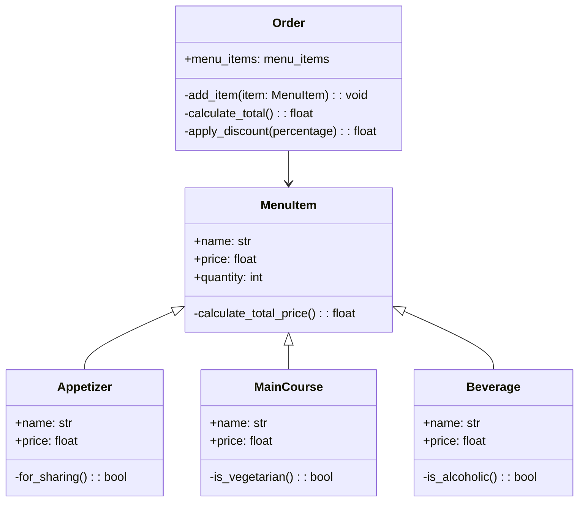

# Poo-Reto-3
El reto #3 de la clase, indica lo siguiente:
1. Create a repo with the class exercise
2. Restaurant scenario: You want to design a program to calculate the bill for a customer's order in a restaurant.
- Define a base class MenuItem: This class should have attributes like name, price, and a method to calculate the total price.
- Create subclasses for different types of menu items: Inherit from MenuItem and define properties specific to each type (e.g., Beverage, Appetizer, MainCourse).
- Define an Order class: This class should have a list of MenuItem objects and methods to add items, calculate the total bill amount, and potentially apply specific discounts based on the order composition.
Create a class diagram with all classes and their relationships. The menu should have at least 10 items. The code should follow PEP8 rules.

## 1. Class Excercise: Clase Linea
```python
import math
class Point: 
    def __init__(self, x, y):
        self.x = x
        self.y = y

class Line:
    def __init__(self, start, end):
        self.start = start
        self.end = end

    def compute_length(self):
        return math.sqrt((self.end.x - self.start.x) ** 2 + (self.end.y - self.start.y) ** 2)
    
    def compute_slope(self):
         return degrees(atan2(abs(self.end.y - self.start.y), abs(self.end.x-self.start.x)))
    
    def compute_vertical_cross(self):
        if self.start.x > 0 and self.end.x < 0 or self.start.x < 0 and self.end.x > 0:
            print("Corta con el eje y")
        else:
            print("No corta con el eje y")

    def compute_horizontal_cross(self):
        if self.start.y > 0 and self.end.y < 0 or self.start.y < 0 and self.end.y > 0:
            print("Corta con el eje x")
        else:
            print("No corta con el eje x")


class Rectangle:
    def __init__(self, line1, line2, line3, line4):
        self.line1 = line1
        self.line2 = line2
        self.line3 = line3
        self.line4 = line4   

    def compute_area(self):
        return ((self.line1.end.y - self.line1.start.x) * (self.line3.end.y - self.line3.x))

    def compute_perimeter(self):
        return 2 * ((self.line1.end.y - self.line1.start.x) * (self.line3.end.y - self.line3.x))
```   
## 2. Restaurant Scenario
Para la solución de este problema, se crea la clase 'MenuItem' que cuenta con dos atributos, nombre y precio, y en la misma clase se define una función para calcular el precio de cada elemento de la clase. A su vez, se crean 3 clases para los tres tipos de consumibles, "Beverage", "Appetizer" y "MainCourse", donde cada uno cuenta con nombre, precio y atributos como: "is_alcoholic", "is_shared" y "is_vegetarian". Por ultimo se crea la clase "Order" que agrupa todo lo consumido por el cliente añadiendolo a una lista de tuplas, junto con funciones para agregar items, calcular totales, aplicar descuento y una para desplegar toda la información del pedido.

```python
class MenuItem:
    def __init__(self, name: str, price: float):
        self.name = name
        self.price = price

    def calculate_total_price(self, quantity: int = 1) -> float:
        return self.price * quantity


class Beverage(MenuItem):
    def __init__(self, name: str, price: float, is_alcoholic: bool = False):
        super().__init__(name, price)
        self.is_alcoholic = is_alcoholic


class Appetizer(MenuItem):
    def __init__(self, name: str, price: float, is_shared: bool = True):
        super().__init__(name, price)
        self.is_shared = is_shared


class MainCourse(MenuItem):
    def __init__(self, name: str, price: float, is_vegetarian: bool = False):
        super().__init__(name, price)
        self.is_vegetarian = is_vegetarian


class Order:
    def __init__(self):
        self.items = []

    def add_item(self, item: MenuItem, quantity: int = 1):
        self.items.append((item, quantity))

    def calculate_total(self) -> float:
        total = sum(item.calculate_total_price(quantity) for item, quantity in self.items)
        return total

    def apply_discount(self, percentage: float) -> float:
        total = self.calculate_total()
        discount = total * (percentage / 100)
        return total - discount

    def print_order(self):
        print("Detalles del pedido:")
        for item, quantity in self.items:
            print(f"{quantity}x {item.name} - ${item.price:.2f} cada uno")
        print(f"Total: ${self.calculate_total():.2f}")


menu = [
    Beverage("Agua", 1.00, is_alcoholic=False),
    Beverage("Coca Cola", 3.00, is_alcoholic=False),
    Beverage("Cerveza", 2.50, is_alcoholic=True),
    Beverage("Copa de Vino", 10.00, is_alcoholic=True),
    Appetizer("Papas Fritas", 5.00, is_shared=True),
    Appetizer("Patacones", 5.50, is_shared=True),
    Appetizer("Nachos", 6.00, is_shared=True),
    Appetizer("Alitas de Pollo", 9.00, is_shared=False),
    MainCourse("Hamburguesa", 10.00, is_vegetarian=False),
    MainCourse("Pizza Napolitana", 12.00, is_vegetarian=True),
    MainCourse("Ensalada", 9.50, is_vegetarian=True),
    MainCourse("Filete de Res", 15.00, is_vegetarian=False)

order.print_order()
print(f"Total con 10% de descuento: ${order.apply_discount(10):.2f}")
]
```
Para probar el codigo, se creo esta orden de prueba.

```python

order = Order()
order.add_item(menu[0], 1)
order.add_item(menu[3], 2)
order.add_item(menu[3], 1)
order.add_item(menu[7], 1)
order.add_item(menu[11], 1)

order.print_order()
print(f"Total con 10% de descuento: ${order.apply_discount(10):.2f}")
```
Lo que termina deplegando lo siguiente en la consola:
```bach
Detalles del pedido:
1x Agua - $1.00 cada uno
2x Copa de Vino - $10.00 cada uno
1x Copa de Vino - $10.00 cada uno
1x Alitas de Pollo - $9.00 cada uno
1x Filete de Res - $15.00 cada uno
Total: $55.00
Total con 10% de descuento: $49.50
```
El diagrame UML de todas las clases, es el siguiente:

